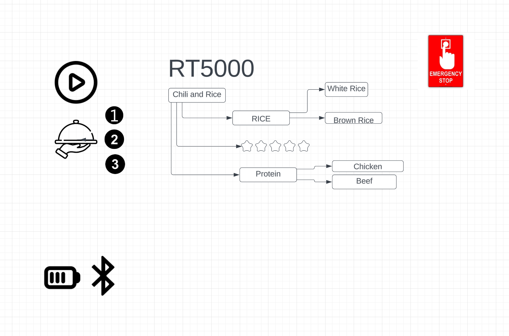

# RT5000
Requirement Gathering and Interview Questions 

1. Will the robot  make meals everyday?
2. Will it be able to clean after itself?
3. How many meal servings can it make at once?
4. Can I set a cooking schedule?
5. Is there a limit to how many recipes it can take?
6. When will it know to be done with a recipe?
7. Who will be using the robot? One person in the household?
8. How long will its battery last?
9. Can is be wireless?
10. Can it connect to other apps that help it calculate ex. grams of a certain macronutrient?
    
[Trello Link- User stories, functional and non-functional requirements](https://trello.com/b/aYL2CIvm/user-stories)

